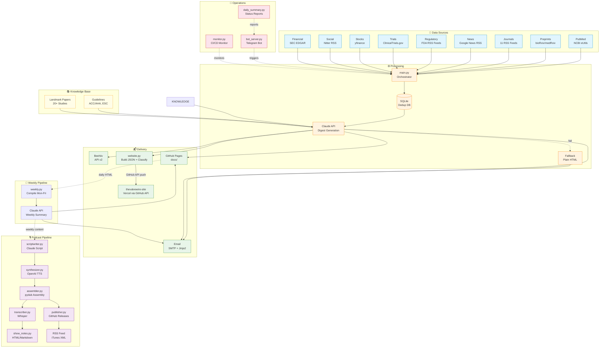
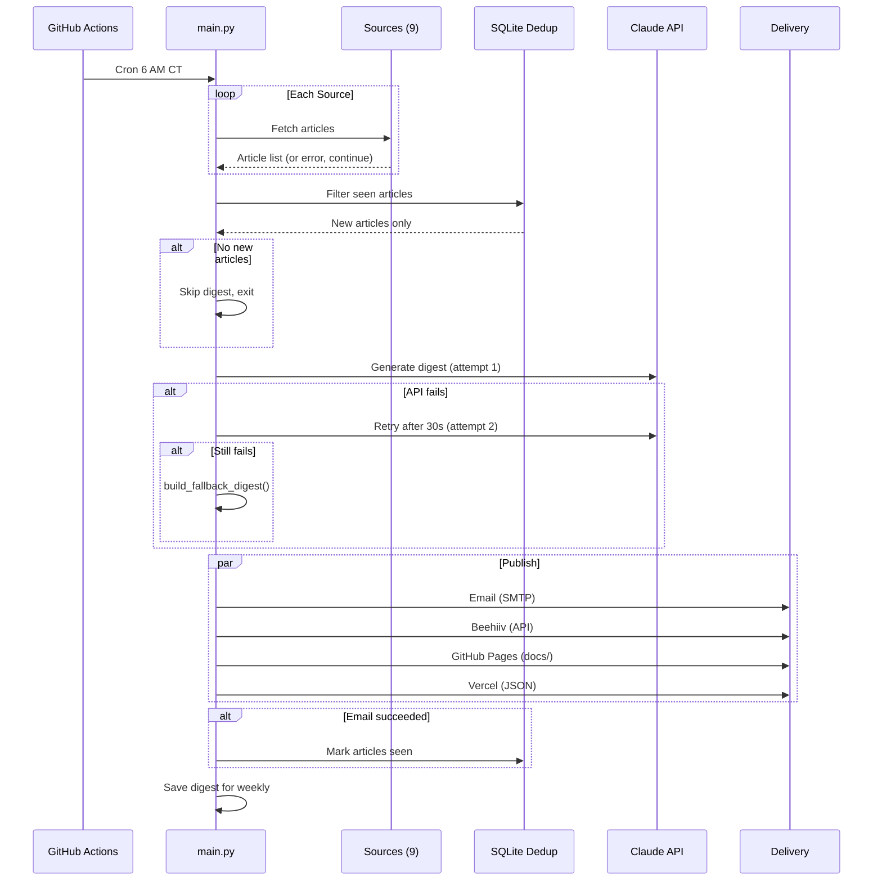
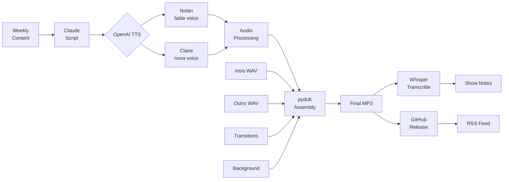
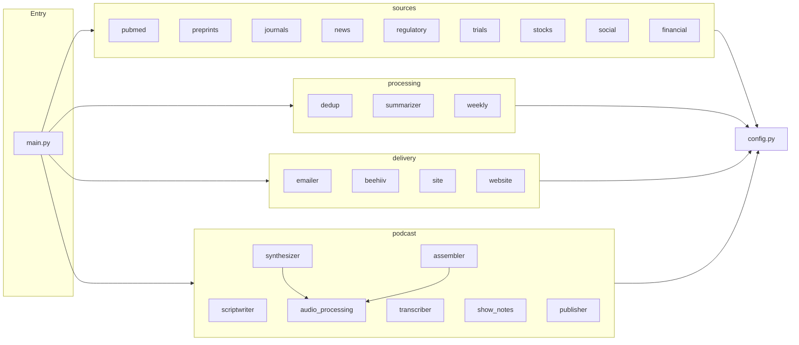
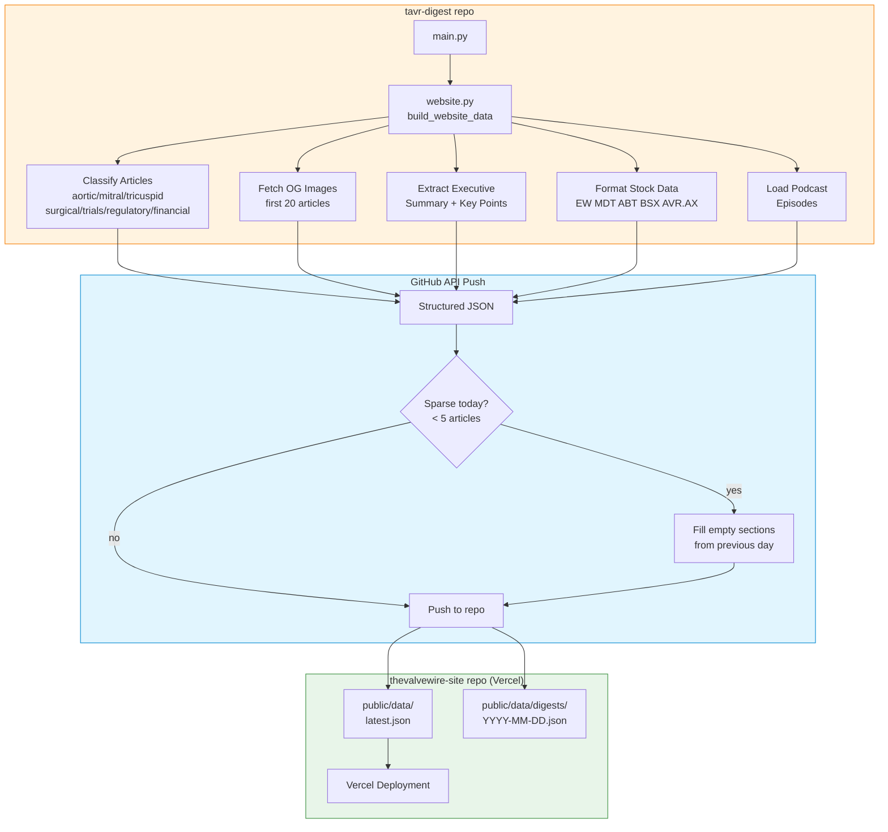
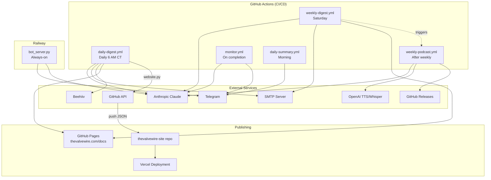

# The Valve Wire — Architecture Diagram

## System Overview



## Daily Pipeline Sequence



## Podcast Generation Flow



## Module Dependency Map



## Vercel Website Data Flow

The Vercel website lives in a separate repo (`mbowdish88/thevalvewire-site`) and receives structured JSON from `delivery/website.py` via the GitHub API.



### Website JSON Structure

```
latest.json
├── date                    # ISO date
├── executive_summary       # Extracted from Claude digest HTML
├── key_points[]            # Up to 5 bullet points
├── sections
│   ├── aortic              # TAVR/TAVI articles
│   ├── mitral              # MitraClip, PASCAL, TMVR
│   ├── tricuspid           # TriClip, TTVR
│   ├── surgical            # Surgical vs transcatheter
│   ├── trials              # ClinicalTrials.gov updates
│   ├── regulatory          # FDA alerts, approvals
│   └── financial           # SEC filings, M&A
│       └── articles[]
│           ├── id, type, title, source
│           ├── url, date, abstract
│           ├── authors, image_url (OG)
│           └── nct_id, phase, status (trials only)
├── stocks
│   └── {ticker}
│       ├── price, change, change_pct
│       ├── high_6m, low_6m, change_6m
│       ├── market_cap, pe_ratio
│       ├── target_price, recommendation
│       └── price_history{}
└── podcast
    ├── latest_episode
    └── all_episodes[]
```

## Infrastructure


